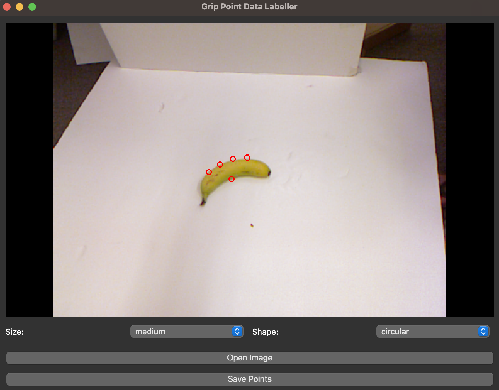

# Humanoid Robot Grasping Data Annotation Tool

This project is an annotation tool designed to create labeled datasets for training a machine learning model capable of predicting where a humanoid robot should grasp an object in an image. The application allows users to load images, mark five grasp points per image, and save the annotations in a structured format (JSON). The generated dataset will serve as the training data for a model that learns optimal grasping points for humanoid robots based on visual inputs.

---


## Features

### Data Annotation Tool
- **Load Images**: Open and display images in the application.
- **Click to Annotate**: Click on the image to mark five grasp points where the robot should interact with the object. The order of clicks should be: Index, Middle, Ring, Pinky, and Thumb.
- **Normalized Coordinates**: Grasp points are recorded as normalized `(x, y)` coordinates relative to the image dimensions, making the data resolution-independent.
- **Save Annotations**: Save the image path and corresponding grasp points to a JSON file for further processing and use for the (CNN) model.

### Output Format
The tool saves annotations in a JSON format like the following:
```json
{
    "image_path": "/path/to/image.jpg",
    "points": [
        {"x": 0.12, "y": 0.45},
        {"x": 0.32, "y": 0.56},
        {"x": 0.75, "y": 0.22},
        {"x": 0.44, "y": 0.78},
        {"x": 0.19, "y": 0.63}
    ],
    "size": "small|medium|large",
    "shape": "circular|rectangular|other"
}
```

## Model Description

### Purpose

The model is not included in this repository, but a description is provided here. The machine learning model aims to predict the optimal grasp points on objects for humanoid robots, enabling them to interact effectively with objects in diverse environments. The model will process visual inputs (images) and output coordinates of potential grasp points.

### Input

- **Image**: A photo of an object captured from the robot's perspective.
- **Features**: Rough size and shape of the object, something a robot may have additional classifier models to obtain. 

### Output

- **Grasp Points**: Five normalized `(x, y)` coordinates on the object where the robot should position its fingers for effective grasping.

### Architecture

The model will likely employ a Convolutional Neural Network (CNN) or a similar vision-based architecture to:

1. Extract meaningful features from the input image.
2. Predict the grasping coordinates based on the features.

### Training

The dataset created using this application will be used to train the model. The training process will involve:

1. **Input Data**: Images annotated with grasp points.
2. **Loss Function**: A regression-based loss function comparing the predicted grasp points with the ground truth.
3. **Evaluation Metrics**: Metrics like Mean Squared Error (MSE) or Mean Absolute Error (MAE) will be used to evaluate the model’s grasping prediction accuracy.
## How to Use the Application

1. **Install Dependencies**: Install the required Python packages using `pip`:
   ```bash
   pip install -r requirements.txt
   ```

2. **Run the Application:** Start the tool by running:

```bash
python GripPointLabeller.py
```

3. **Annotate Images**:

- Load an image using the "Open Image" button.
- Click on the image to mark five grasp points.
- Save the annotations in JSON format.
- Output: The JSON file (annotations.json) will contain the image path and normalized grasp points.

4. **Output**:
The JSON file (annotations.json) will contain the image path and normalized grasp points.